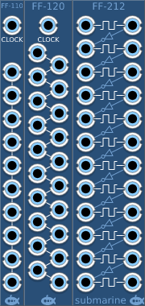

# Flip-Flops
### [Part of the Digital Suite](DS.md)
#### FF-110 10-Stage Flip-Flop Cascade
#### FF-120 20-Stage Flip-Flop Cascade
#### FF-206 6 Edge Triggered Flip-Flops
#### FF-212 12 Edge Triggered Flip-Flops

## Basic Operation

A Flip-Flop or Toggle Latch changes its state from 0 to 1 or back again every time that it is triggered. It is designed to take digital signals, but it will happily accept analog sygnalse. The Flip-Flop devices are triggered by a rising edge on the input signal and the output changes to a high level signal if it was previously low, or to a low level signal if it was previously high.

## Cascades

The FF-110 and FF-120 Flip-Flop cascade devices contain a chain of linked Flip-Flops. The first in the chain is triggered by the rising edge of the input signal, but each subsequent device in the chain is triggered by the falling edge of the previous device. The result is that each output alternates between high and low signals at half the rate of the previous device; effectively forming a binary counter.

## Normalling

The FF-212 module contains 12 independant Flip-Flops each triggered on the rising edge. However, if nothing is connected to the input, the device is normally connected through an inverter to the output of the previous device. The module can be used as independant Flip-Flops, or as one or more multi-stage cascades.

The FF-206 provides 6 independant Flip-Flops in a small form factor. Otherwise functionality is as for the FF-212 above.

## Initialize and Randomize

All the FF-1xx and FF-2xx devices can be reset using the Initialize context menu. All the Flip-Flop gates will turn off.

All the FF-1xx and FF-2xx devices can be randomized using the Randomize context menu. Each Flip-Flop gate will be randomly turned on or off.
